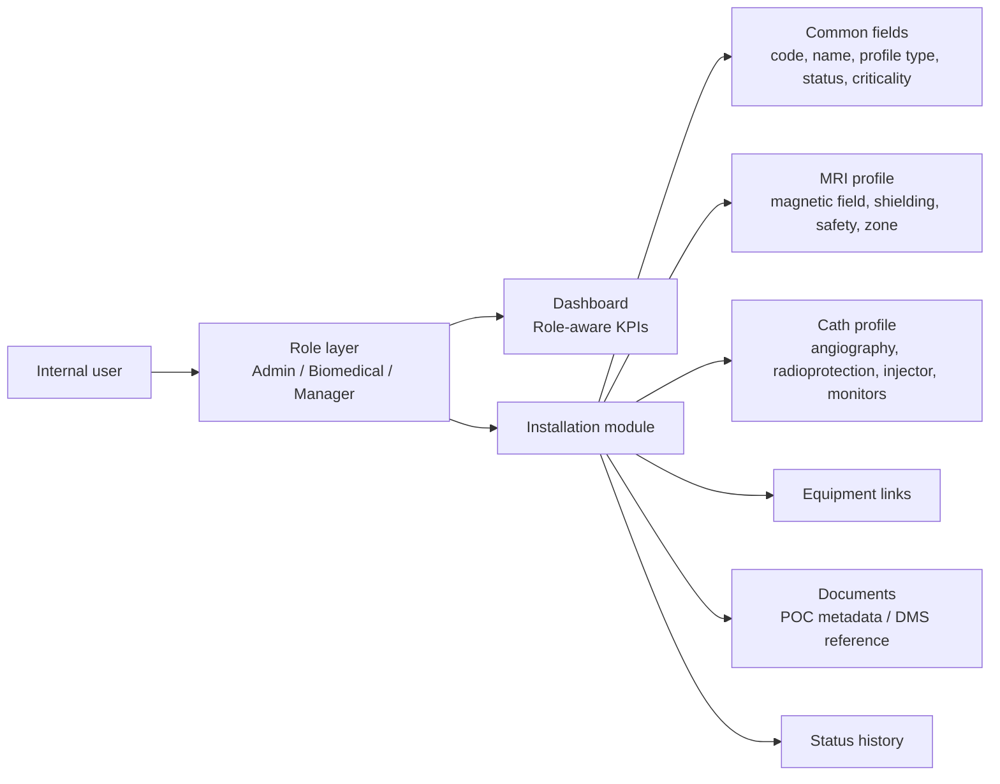
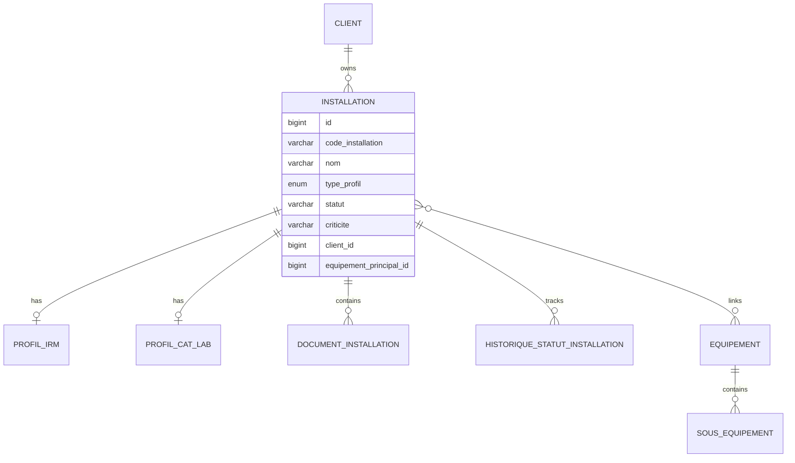
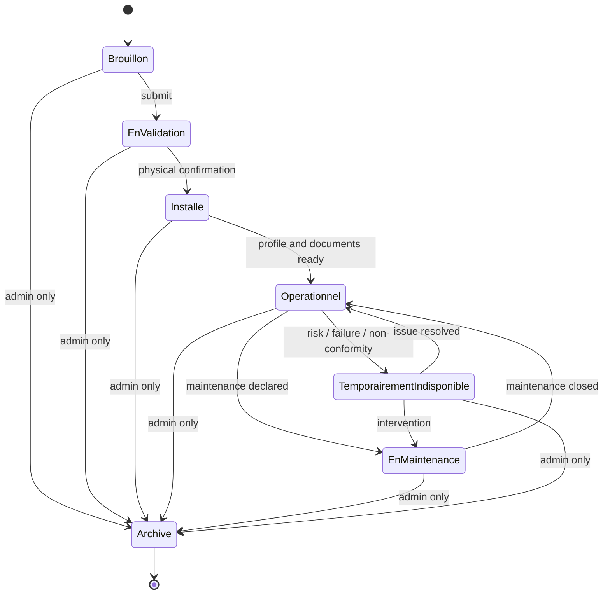

<p align="center">
  
  
  
</p>

<h1 align="center">GMAO Healthcare - Module Gestion des Installations</h1>

<p align="center">
  Extension exploratoire d'une plateforme GMAO existante pour structurer le suivi des installations médicales Philips Healthcare.
</p>

<p align="center">
  
  
  
  
</p>

---

## Project Snapshot

This repository contains a Proof of Concept for a new **Installation Management** module inside a local healthcare GMAO context.

The module introduces a parent entity, `Installation`, that groups:

- a medical room or operational environment,
- one specialized child profile,
- equipment references,
- document references,
- status history,
- role-aware access and KPI visibility.

The POC currently targets two installation profiles:

| Profile | Purpose | Current state |
| --- | --- | --- |
| IRM / MRI | MRI room-specific infrastructure and safety fields | Integrated in create, edit, show, validation, and tests |
| Cathétérisme / CathLab | Cath lab room-specific fields | Existing model/controller foundation, ongoing parallel scope |

---

## POC Goals

| Goal | Description |
| --- | --- |
| Parent installation record | Create, list, view, edit, and archive logical installations |
| Profile separation | Keep common installation data separate from MRI/Cath-specific fields |
| Internal role matrix | Differentiate administrator, biomedical team, and manager permissions |
| Status lifecycle | Control key transitions between draft, validation, installed, operational, maintenance, unavailable, and archived states |
| Operational dashboard | Show role-aware KPIs and installation alerts |
| Equipment and documents | Link installations to equipment and document metadata as a DMS-compatible POC fallback |
| Demonstrable Laravel structure | Keep the implementation simple, readable, and compatible with Laravel conventions |

---

## Illustrated Architecture





---

## Current Feature Map

| Area | Implemented | Notes |
| --- | --- | --- |
| Dashboard route | Yes | `/dashboard`, root redirects to dashboard |
| Role-aware dashboard | Yes | Biomedical sees operational KPIs only; admin/manager see strategic KPIs |
| Role switch for POC demo | Yes | Use topbar buttons or `?role=admin`, `?role=biomedical`, `?role=manager` |
| Server-side policy checks | Yes | Create/update/delete/status access guarded through policy checks |
| MRI profile integration | Yes | Create, edit, show, persistence, and tests |
| Cath profile integration | Partial | Existing controller/model foundation; full parent-flow integration belongs to Person B scope |
| Status lifecycle checks | Yes | Invalid jumps rejected; archive is admin-only |
| Installation list filters | Yes | Profile, status, client ID, main equipment, missing blocking docs |
| Installation list sorting | Yes | Recent, oldest, criticality, alphabetical, code, profile, lifecycle status |
| Document attachment POC | Partial | Basic metadata exists; richer DMS fields/versioning are future or Person B scope |
| Calendar | Guarded placeholder | Dashboard handles planning count only if future planning columns exist |
| Tests | Yes | Person A feature tests cover MRI, permissions, status, dashboard, sorting |

---

## Role and Permission Matrix

| Action | Administrator | Biomedical team | Manager |
| --- | --- | --- | --- |
| View installation list/detail | Yes | Yes | Yes |
| View operational KPIs | Yes | Yes | Yes |
| View strategic KPIs | Yes | No | Yes |
| Create installation | Yes | Yes | No |
| Edit common fields | Yes | Yes | No |
| Edit MRI profile | Yes | Yes | No |
| Link equipment | Yes | Yes | No |
| Attach/replace documents | Yes | Yes | No |
| Change operational status | Yes | Yes | Read/validation future only |
| Archive/delete installation | Yes | No | No |
| Manage users/roles | Yes | No | No |

The role selector in the topbar is intentionally present for demo purposes. It makes the POC easy to validate without building a full authentication UI.

---

## Status Lifecycle



---

## Main Screens

| Screen | Route | Description |
| --- | --- | --- |
| Dashboard | `/dashboard` | Role-aware KPI view and recent installations |
| Installation list | `/installations` | Filtered and sortable table |
| Create installation | `/installations/create` | Common fields and MRI-specific section when profile is IRM |
| Installation detail | `/installations/{id}` | General data, profile, equipment, documents, status history |
| Edit installation | `/installations/{id}/edit` | Update common fields and MRI profile fields |
| Equipment | `/equipements` | Existing equipment management screens |
| Sub-equipment | `/sous-equipements` | Existing sub-equipment screens |
| Documents | `/documents` | Basic document metadata screens |

---

## Repository Structure

```text
app/
  Http/
    Controllers/
      DashboardController.php
      InstallationController.php
      ProfilCatLabController.php
      DocumentInstallationController.php
      EquipementController.php
    Middleware/
      DemoRoleMiddleware.php
  Models/
    Installation.php
    ProfilIRM.php
    ProfilCatLab.php
    DocumentInstallation.php
    Equipement.php
    SousEquipement.php
    User.php
  Policies/
    InstallationPolicy.php
  Services/
    InstallationStatusService.php

database/
  migrations/
  seeders/
  factories/

resources/
  views/
    dashboard.blade.php
    layouts/app.blade.php
    installations/
    documents/
    equipements/
    sous-equipements/

tests/
  Feature/
    PersonAInstallationTest.php
```

---

## Quick Start

### 1. Install PHP dependencies

```bash
composer install
```

### 2. Prepare environment

```bash
copy .env.example .env
php artisan key:generate
```

For local SQLite usage, set:

```env
DB_CONNECTION=sqlite
DB_DATABASE=database/database.sqlite
```

Then create the SQLite file if needed:

```bash
type nul > database\database.sqlite
```

### 3. Run migrations and seed demo users

```bash
php artisan migrate --seed
```

Seeded demo users:

| Name | Email | Role |
| --- | --- | --- |
| Admin POC | `admin@example.com` | `admin` |
| Biomedical POC | `biomedical@example.com` | `biomedical` |
| Manager POC | `manager@example.com` | `manager` |

### 4. Start the local server

```bash
php artisan serve
```

Open:

```text
http://127.0.0.1:8000/dashboard
```

---

## Demo Role Switching

The POC supports a lightweight role switch through the UI topbar or query parameters:

```text
/dashboard?role=admin
/dashboard?role=biomedical
/dashboard?role=manager
```

This is only for POC demonstration. A production implementation should connect this matrix to the GMAO authentication and authorization layer.

---

## Testing

Run the full test suite:

```bash
php artisan test
```

Run only Person A scope tests:

```bash
php artisan test --filter=PersonAInstallationTest
```

Covered Person A behavior:

- Biomedical can create an MRI installation with child profile.
- Manager cannot edit an installation.
- Biomedical cannot archive an installation.
- Invalid status transition is rejected.
- Biomedical dashboard hides strategic KPIs.
- Admin and manager can see strategic KPIs.
- Installation list can sort by decreasing criticality.

---

## Delivery Ownership

| Owner | Scope | Current repository state |
| --- | --- | --- |
| Person A | Roles, authorization, status workflow, MRI profile, KPI dashboard, tests | Implemented in current branch |
| Person B | Cath profile integration, document/DMS fallback expansion, equipment/sub-equipment refinements, calendar | Parallel scope, expected to be merged separately |
| Shared | Migration consistency, demo data, final integration, demo script, documentation of limits | In progress |

---

## POC Boundaries and Open Points

This project is intentionally a POC, not a production-ready GMAO module.

| Topic | Current decision |
| --- | --- |
| External access | Excluded |
| Supplier or subcontractor portal | Excluded |
| Full DMS integration | Deferred unless an existing DMS table/service is confirmed |
| Manager validation workflow | Optional and disabled by default |
| Budget tracking | Optional, not mandatory in PRD/scope |
| Full time-spent tracking | Optional, not mandatory in PRD/scope |
| Calendar | Expected demo item, pending planning-date integration |
| Audit logs beyond status history | Future improvement |

---

## Useful Commands

```bash
# Run development server
php artisan serve

# Run migrations from scratch
php artisan migrate:fresh --seed

# Run tests
php artisan test

# Clear cached framework state
php artisan optimize:clear
```

---

## Internal Documentation Artifacts

Additional planning and tracking outputs may exist in:

```text
docs/
outputs/
tools/
```

These include the Person A / Person B checklist workbook and POC implementation split notes used during delivery planning.

---

## Project Identity

| Field | Value |
| --- | --- |
| Project | Stage 1 mois - Philips Healthcare / ST IET |
| Module | Gestion des Installations |
| Nature | Laravel POC for feasibility and internal demonstration |
| Profiles | IRM and Cathétérisme |
| Main entity | Installation |
| Target users | Administrator, biomedical/maintenance team, optional manager |
| Primary objective | Demonstrate a coherent parent Installation module connected to profiles, equipment, documents, status lifecycle, roles, and KPIs |

